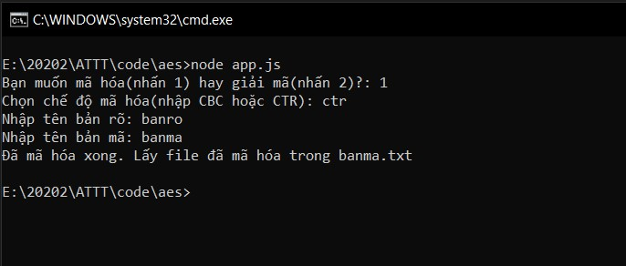

## Mô tả:
* Đây là chương trình dùng dể mã hóa và giải mã dữ liệu, sử dụng hệ mã khối **AES** với 2 chế độ mã hóa là **CBC** và  **CTR**
* Chương trình sử dụng thư viện có sẵn trên npm : `aes-js`
* Chương trình lấy *dữ liệu* và *key* cần mã hóa dưới dạng file `.txt`, sau đó sinh ngầu nhiên dãy *IV* rồi mã hóa dữ liệu
## Cách dùng:
* Copy file cần mã hóa/giải mã vào thư mục gốc của chương trình
* Thay đổi key tại file `key.txt` 
* Bật **Terminal** và sử dụng lệnh:
` node app.js`
* Điền các thông số yêu cầu

* Lấy dữ liệu trong file vừa tạo ra